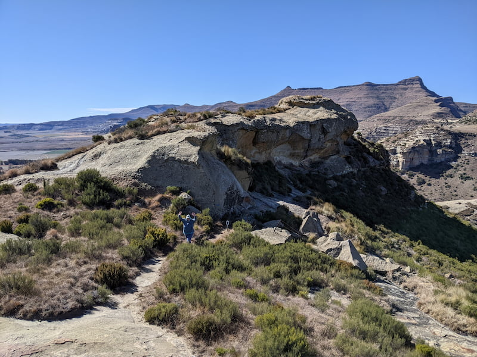

It's a must to go visit Clarens in the Free State. It's a beautiful small town in the mountains with a number of shops and restaurants to visit. They have well marked and documented trails that take various routes through the town and further out. It costs R30 for a permit which lasts a week. No one really checked if you had a permit but I recommend you get one to help support the conservancy.

The views are spectacular and provide great photo opportunities. There are benches situated throughout the trials so you can really take your time out there with breaks. Most of the routes are not too technical and suitable for most people. I recommend buying a map from the conservancy office as it has good information about distance and things to look out for.

The town also does a parkrun every Saturday on the trails. I enjoyed doing this as it goes over a few bridges and past a small dam.

I recommend doing the Titanic trail as it goes up high past a rocky outcrop that looks like the front of the Titanic. 

Make sure to pack a windbreaker or raincoat. We didn't get wet in August but it was very windy and cold at the top of the mountains.