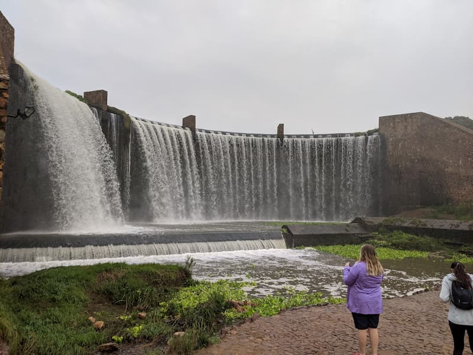

This is a fantastic place to visit and hike. There is a large lake with an impressive dam wall which is beautiful when flowing. There are animals and a large number of activities you can do; swimming, kayaking, cycling and hiking.

There is a restaurant so you can grab some food before or after a hike. There are a number of routes for hiking and cycling. I would recommend the green route if you are hiking as it goes around the lake.

The routes are easy and suitable for children I would say. They are well marked.

There is a cost of R70 for the hike last time I went which is maybe the only small drawback.

It is a popular spot as it offers so many activities so close to Johannesburg, so starting early might be a good idea if you are out there on the weekend.

