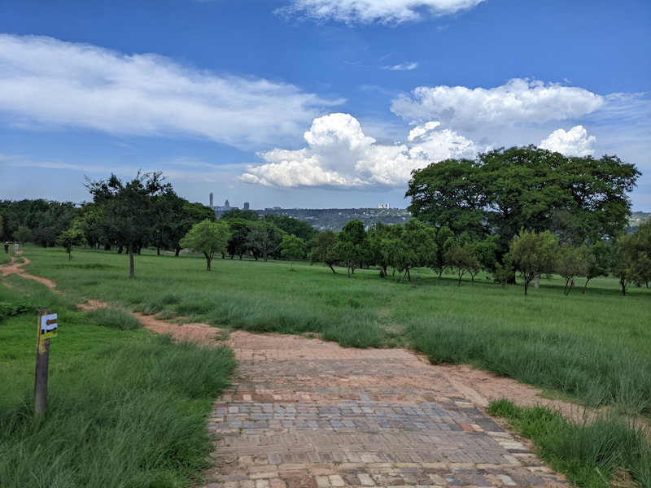

Delta Park is in the heart of inner Johannesburg suburbs and therefore quite busy with families and people exercising and walking dogs. It has a number of walking and cycling trails for you to try that are very family friendly. There are open grass areas, 2 small dams and a jungle gym. 

They host a parkrun ([https://www.parkrun.co.za/delta/](https://www.parkrun.co.za/delta/)) every Saturday at 8am which is one of the bigger parkrun's in the country and highly recommended by me. So there is a nicely marked 5km route to run and walk on other days.

The trails do provide alternative routes for cyclists to pass walkers and a few short mountain bike routes. 

The park is quite accessible with many gates and entrances with ample parking inside. There are usually car guards at the parking areas taking tips from park users. The park connects to the popular Braamfontein Spruit ([http://jozitrails.co.za/](http://jozitrails.co.za/)) that connects the other parks and suburbs in the area along the river. 

Delta park is fairly safe, however because of the easy access provides an opportunity for criminals to take advantage of park goers. So stick to popular times and try not run/walk with valuables.

Many dog walkers will let their dogs off leads, but are pretty well behaved from my experience.