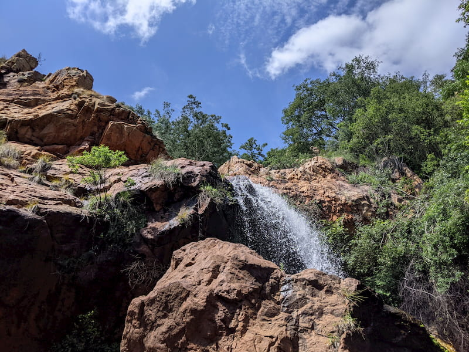

This is a fun hiking, running and cycling spot near Johannesburg. There are a number of trails to choose from and a small waterfall to check out on the routes.

The trails are as follows:

- 6km Green Easy
- 10km Blue Moderate
- 19km Black Difficult
- 25km Red Technical

There is a large parking lot and a small coffee shop that sells a bunch of things to eat and drink.

The routes are a little windy because I think it's made for cycling so you'll be looping back on yourself in a few spots. It's fairly well marked, but may be confusing sometimes.

The waterfall is a few 100 meters off the main routes but worth checking out. You cross the river feeding the waterfall throughout the route. There is also a nice lake, which seems popular for people to camp and fish at. We also saw a bunch of cows.

We did the blue hiking trail which was a nice hike past the waterfall.

The cost is R40pp which is good.

It's only open on public holidays and weekends 5:30am and closes at 15:00pm. No dogs allowed.
