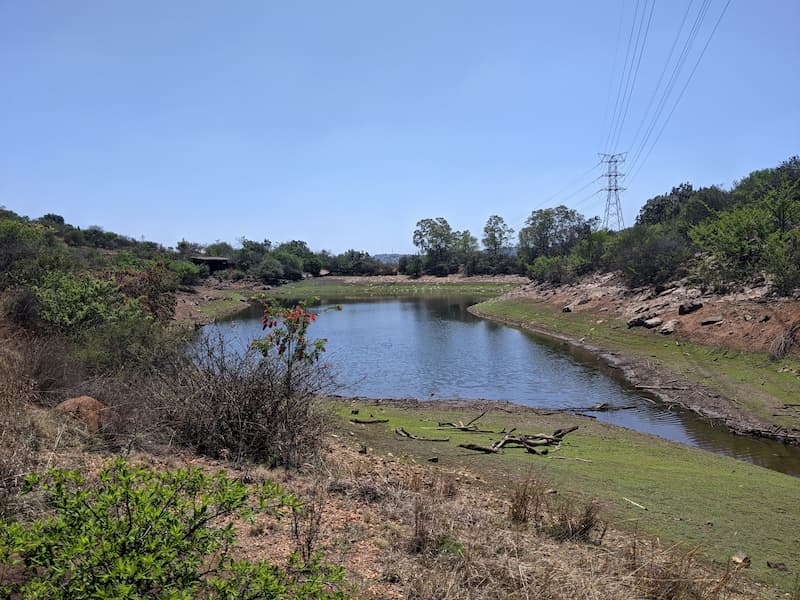

The Kloofendal nature trail is great because you can get the feel of being far away in the outdoors but it's actually nearby in Roodepoort Johannesburg. 

The entry is free and it is open from 6:00 to 18:00 and only closed if there is a fire hazard (lots of long dry grass). There is a guard at the gate to sign in and ample parking. 

After you’ve parked and walk into the reserve there is an amphitheatre with a large open area for you to relax and have a picnic, I saw a couple people chilling out in the sun. There are bathrooms and a couple thatched roofs for you to sit under if the sun gets hot.

There are 4 routes ranging from 0.5 to 3.5 km. There is a trail for everyone here, simple, short and easy to a little harder and steeper. All of the trails I think are suitable for children and first timers. The tougher red route (Dassie) has some steep and rocky bits. The routes are well maintained with grass cut and obstacles removed. 

Look out for the dam and the wonderful views from the top of the hill. Also there is an old mine in the reserve but it's closed off.

No dogs allowed.

