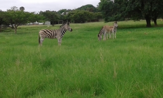

If you're looking to escape the city of Pretoria from within the city, Moreleta Kloof Nature Reserve is the place to be. 
The park offers various trails suitable for all members of the family and has some Zebras and other animals. You can do just over 5KM on the main trail (a combination of the Suikerbos and Duiker routes).

You are guaranteed to see some animals as they are pretty tame and often hang around in the open areas. There is a bird hide on route if you into birds. There are a few benches on the route if you need some rest and a toilet on the route. The route is well marked.

There is a restaurant on site called Rademeyers with a bar.

No dogs allowed. Parking is secure behind a gate and there is a guard.