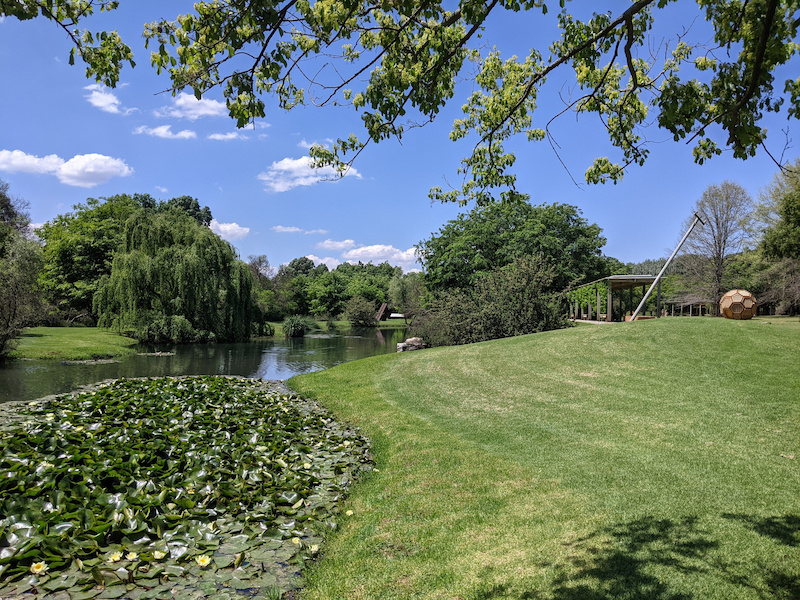

This is not really a hiking trial but you can spend the day walking around the sculpture park enjoying the lush green grass, water and of course all the art. 

It is R120 per person, so I would recommend you pack picnic supplies (snacks, water and a picnic blanket) so that you can spend a few hours exploring and relaxing on the banks of all the ponds.

They have a fancy restaurant on site called 'And then there was Fire…' which you need to book ahead of time (this gives you a reduced entrance fee to the park). They do have a cafe on site for people visiting the park (incase you don't bring any supplies). It is a bit pricey though, but has good stuff.
  
If you want to have a day out with people that are not into walking, this is ideal as some of the group can walk around the park while others relax on a picnic blanket. They do have benches, chairs and spots to sit around the park.

They are only open on the weekends from 10:00 - 16:00.
It wasn't clear if dogs were allowed. There is adequate parking and you can pay with a card or cash at the entrance. There are toilets on site.
