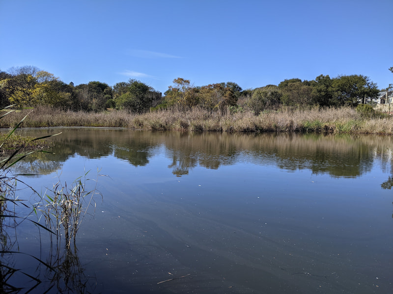

The Norscot Koppies Nature Reserve is smack bang in the middle of the Fourways area in Johannesburg. It is only open twice a month on the second and last Sunday of the month. 

The entry is free but a donation to the up keep is encouraged. At the entrance the volunteers ask you to sign in and have some rocks and items found in the park on display.

The trail is fairly short and has various points of interest branching off the main trail. They have a nice PDF guide on the website you can download that explains all the points of interest. This is an ideal short outing for families with children. You will also learn some things from the guide.

There are some granite quarries from the 1940s in the park so you will see some mounds of granite pieces which I haven't seen before. Climbing the koppies give you good views of the area. There are 2 dams with enclosures for bird watching. I saw lots of remnants of animal life and saw some dassies on the koppie.

It's worth having a look at this park as it's in the city and doesn't require a long drive to access.

No dogs allowed.