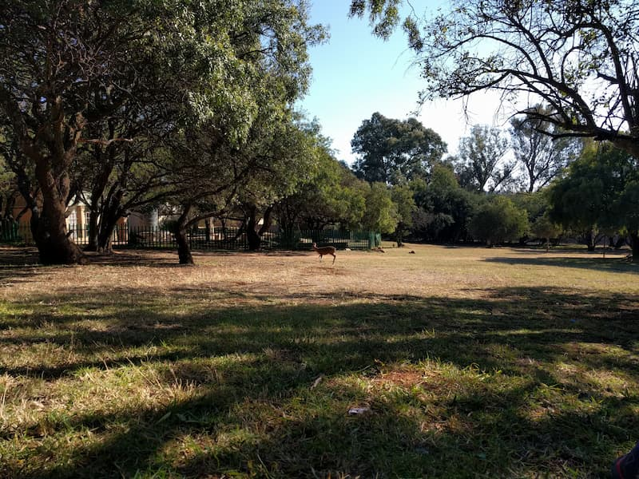

A lovely little 24 hectare bushveld nature reserve in North Johannesburg. It has a nice beginner friendly 2.5km hiking route that takes you around and over a small koppie. It has a nice view from the top of the surrounding concrete jungle of Johannesburg North. The route is well marked and has some information boards about animals in the area which will be good for kids.

Many people come for picnics as there is a nice open grass area. There are some small animals in the property which are easily spotted. 

No dogs allowed. It is an enclosed nature park with a large fence around so it is safe. THere is ample parking inside and you sign in at the gate when you arrive. 

I also recommend this trail for a quick trail run during the week when its quiet. You can run the loop multiple times to get some distance.