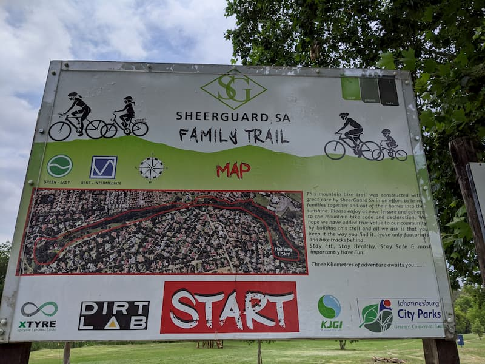

Update - They have removed the 3km bike track signage so maybe stick to walking and running. The bicycle ramps are still active.

A busy family and dog walking spot which includes a wonderful short 3km mountain bike route in Douglasdale. The Klein-jukskeirivier river passes through this city park which is a nice sight after some rain.

This park is situated in the suburbs so late afternoon and the weekend it gets pretty full of families, dogs and their kids on bicycles. The community has also built some bicycle ramps which the kids (and me) seem to enjoy.

Lots of dog walkers and there are security guards so it's a safe place to go. It seems pretty well supported and maintained by the surrounding community.
