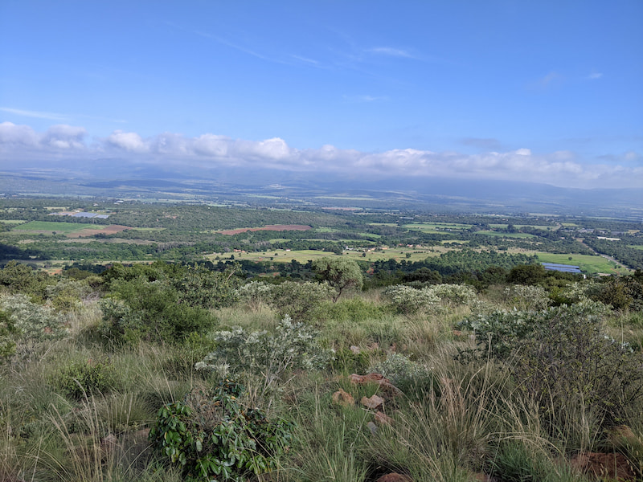

The Sable Ranch trail is about an hour from Johannesburg just below the Magaliesburg mountains. The route provides you with a great view of the Magaliesburg mountains and surrounding area.

There is a 5, 8 or 12km hiking trail. It starts on the other side of the road in a place called Nobel Village which is a restaurant with a bunch of other tourist activities to try. The route is well marked and takes you past some 4x4 tracks. I'm nt sure what it's like hiking while people are testing out their 4x4 driving skills. The route crosses under the road and basically heads straight up a steep and rocky climb, but it follows an old cement and stone road so its not too hard on the ankles. The views are really nice from the top of climb. You go past the Sable Ranch accommodation block and then at the top of the climb the route splits and you can take the 5km back down (the other side of the accommodation block). The 8 and 12km head further up an around the mountain top. You get great views of the Magaliesburg mountains and surrounding area. You will also see some animals as we saw some sable grazing.

We were joined midway through the climb by a very tame farm dog that walked with us most of the way. 

The trail seems to be popular as we saw other hikers and people picnicking  and is dog friendly.

The hiking costs R70 per person. Pack sunscreen and a hat there is not many trees going up the climb.