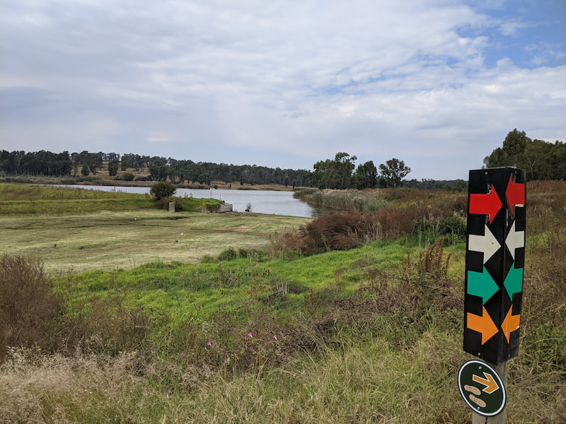

Taroko Trail Park is next to Modderfontein Reserve and offers a variety of activities including: cycling, trail running, hiking and fishing. There are a number of small lakes/dams in the park which attract a variety of birds. The Fourways Farmers market has moved here so if you there on the weekend you can visit the different stalls.

There are a number of cycling and hiking routes (trail running) to choose from with different difficulty levels. The routes were well marked with coloured arrows at each intersection or turn.

We did the green mountain biking route which is 20km. There was a good mix of normal dirt roads, single track, forest and rocky sections. There was even a tiny bit of old tar road which is sometimes nice after bouncing around on a dirt track for a while. There were some nice fast bumpy downhill sections and a few small technical bits though the forest section.

We were there on a weekday and it was empty, however with the farmers market and being located in Johannesburg I expect it to be busy on the weekends.

The cost for cycling was R50. Hiking or running costs R30. This feels fair as it looks well maintained.

There was a cycling shop and the trail pay station had refreshments you could buy.

I will be going back to try a trail run.
