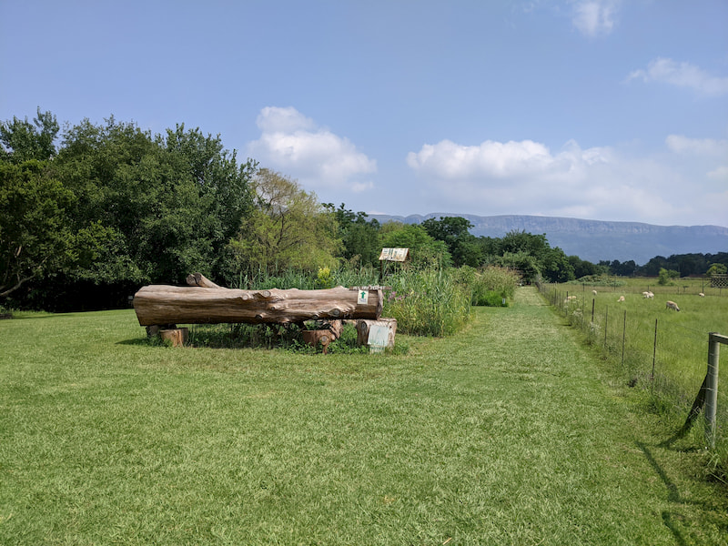

This is a beautiful hiking and cycling spot near the Magaliesburg. The farm has a number of routes which go next to and away from the river passing through the farm. It's called the Van Gaalen Cheese farm because yes there is a small cheese making operation on site. There is a restaurant and farm stall where you can buy the cheese after a full hike. 

We took the river trail 12km which goes along the river and it has a number of reed forests and trees so you are not out in the sun all day which was nice.

There is a parking lot with a guard. The cost to hike is R40pp which is good.

There were a number of people walking and cycling on the weekend we went but it wasn't crowded because of the variety of trails. It was very clean too.

There is a small dam and some farm animals at the beginning of the trails. 

The Magaliesberg mountains are in the background which is nice to see.

It's open from Wednesday - Sunday 10am - 8pm. Weekends open earlier around 7am. No dogs allowed.

