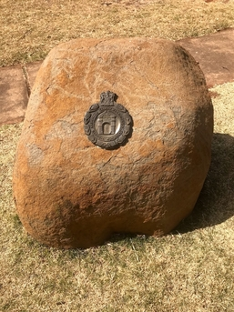

Wonderboom Nature Reserve is named after the wild fig (Ficus salicifolia) which means *miracle tree*.
A legend that places the remains of a chief of an indigenous tribe beneath its roots serves to explain the size of this particular Wonderboom (miracle tree). It was originally a lot bigger, so big it was reputed to provide shade for 1 000 people at a time, or 22 ox wagons. Source:[sa-venues.com](https://www.sa-venues.com/game-reserves/wonderboom.php)

The cost is R37 for adults and R23 for pentioners and kids between 7-17years, R15 for pre-school kids.

