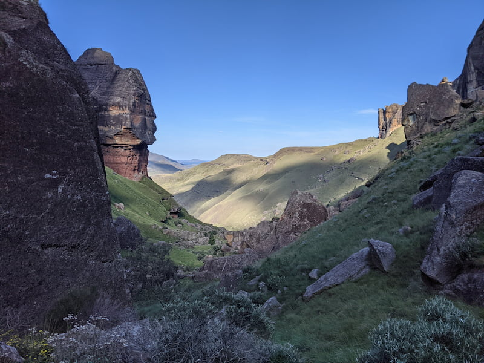

Garden Castle is a nature reserve near Underberg in the Maloti Drakensberg Mountains. There are a few hiking routes that start from the Garden Castle camp grounds. For a small fee (R40) you can do one of the hikes.

We did the Sleeping Beauty cave route which tracks a river all the way up through a valley to a cave. There are pools formed by the river and rocks throughout the walk so you can fill up with clean mountain water or take a swim. There are not may trees in the area so if the sun is out you will need a hat and put on tons of sunblock. The route is full of spectacular views of the surrounding mountains. There are some steep sections with a little bit of rock scrambling. The route is 8km and it took us 4-5 hours mainly because its straight up to the top of the mountain (hard). At the end you can enter the sleeping beauty cave which is an overhanging rock with the river passing though. Here you can break and chill out before coming down again. We saw some baboons but we were otherwise alone, it's amazing being somewhat isolated and alone. You can go up with the path higher up past the cave. We didn't go up higher.

All the routes seem to be out an back. This actually works well here as you end up going steep up toward the mountains and then coming back you go downhill so its easier towards the end.

There is a cost of R40 for the hike when we went, which is good value as it takes the whole day.

The lady at the hiking cabin was very helpful showing us the start of the route and they provided a basic map. There is only really one path once you on the route so there are not any signs apart from at the beginning.

To enter the Garden Castle hiking area you pass through Drakensberg Gardens Golf & Leisure Resort. You sign in, say you going hiking and follow the signs to the campsite area. The roads leading up to the Drakensberg Gardens Golf & Leisure Resort have some large potholes and then the road to the campsite is a bit busted up. We were in a normal hatchback so not too bad just go slow.

All routes from the campsite (distances and time from the map given):

- Pillar Cave 9km (3-4 hours)
- Sleeping Beauty Cave 8km (3-4 hours)
- Three Pools 9km (3-4 hours)
- Hidden Valley 18km (4-5 hours)
- Rhino Peak 22 km (10 hours)
- Pillar Annex 9.8km (3-4 hours)