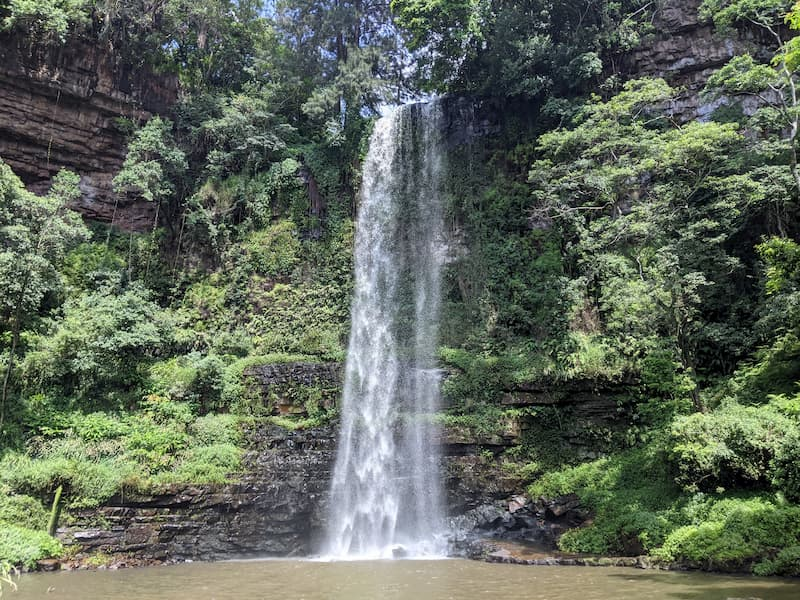

Giba Gorge is a mountain bike park near Pinetown. There are a number of mountain biking and hiking routes to try. There is a restaurant, a playground and bike rental available here.

We did the yellow hiking route at 8.5km which goes past two waterfalls. It's a really beautiful walk through the valley. You start going through the edge of the Giba business park then into the forest passing by another coffee shop and lake on the way to the first waterfall. Further on you do some scrambling up some rocky sections with a ladder and rope. A strange highlight was walking under the N3 bridge towards the large second waterfall, with this high concrete road sticking out of the forest. The second waterfall is quite a site and I recommend you take the route up towards the top to get a second view from the top of the waterfall.

We found this route quite challenging but it might have been the extra steep climbing to the top of the 2nd waterfall that made it harder than expected. 

There is a cost of R25 for the hike when we went, which is good value.

The people at the front desk were very helpful explaining the route and things to look out for.

It looks like it might be very popular on the weekend.

