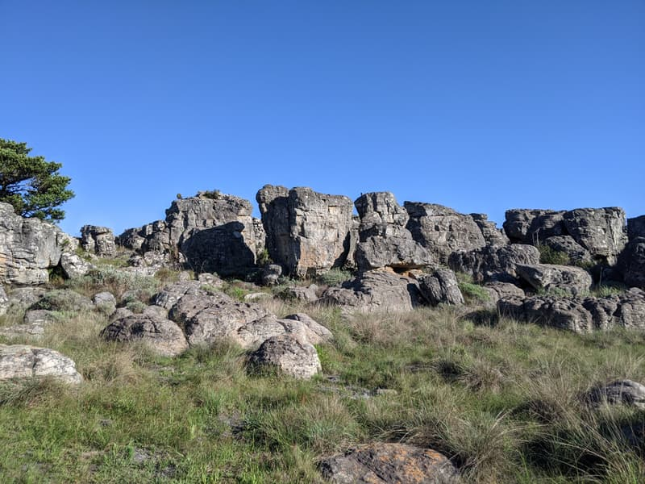

If you are out in the small town of Kaapsehoop you can do this short 3km route right from the center of town.

It has a very nice lookout point halfway through which looks out from a high ridge over the valley floor below. You walk through some very interesting rock formations with ferns and beautiful flowers sticking out all over. There are also wild horses in the area that hang around throughout the town and the hiking routes, which makes this place even more unique.

There are a number of other routes in the area marked (try get a map from one of the shops in the town). This Kaapsehoop Nature Trail is the easiest and shortest and a must do if you are in the area.
The weather in Kaapsehoop can swing from hot to cold and rainy in a blink of an eye, so make sure to pack a raincoat if you are doing longer routes.

The route is well marked with yellow footprints painted on the rocks. The sign suggests it will take 1 hour.

Dogs allowed.

