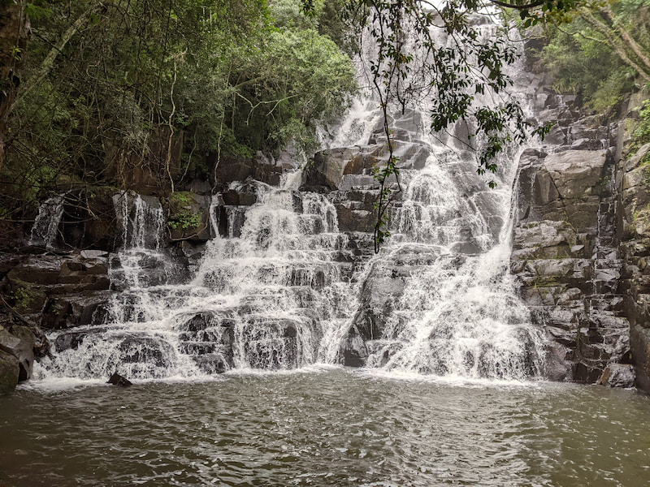

If you like waterfalls, forests and beautiful mountainous views, the Wathaba Hiking Trails are worth a visit.

There is day hiking available but majority of people seemed to be staying the weekend. This is because of the location and there are two routes the Lynx Loop (10km) and Bosbokroete (4km) which you would do over your stay. There are a number of different options for accommodation.

The routes are well marked and maintained. You can drink the water on the farm so you don't need to pack loads of water for the hikes.

The 10km Lynx Loop is fairly tough. It was very wet and muddy when we did the route so it may have been harder than normal. You start off in a forest area criss-crossing a valley river over wooden bridges going past multiple pools and waterfalls. I expect when it's warm you can swim. Then you head up into the mountains, there are ladders and rock stairs to help you climb. There is a range of vegetation throughout the hike from wooden forests, aloe forests to open grasslands. The views from the top of the mountain are very pretty as you can see the valley and a waterfall if you lucky. After going up an down different parts of the mountain you end off with a steep and muddy switchback down to the starting point. This hike takes 4-6 hours so pack some food, sun block and a waterproof.

The 4km Bosbokroete is a fairly easy route that follows the valley river up and back down. You pass the rainbow falls and then see them again on the other side coming back. It's mostly forest cover throughout the walk, you also pass multiple pools that you can swim in. There are some steep sections but they are pretty manageable with ladders or rock steps.   

The farm has pretty good facilities and I recommend doing the weekend if you live far away.

No dogs allowed.