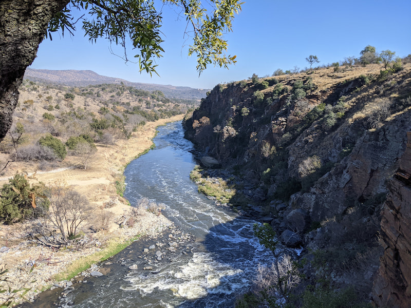

A dog friendly trail in Hartebeespoort with river views and for something different the Pelindaba nuclear research center is seen on the routes. 

It cost R40 per person for hiking paid at the gate entrance. There is toilets and a small bar/restaurant at the start of the trail. Also the website mentions a number of other activities like rafting, quad biking, climbing, fishing and abseiling.

The route we took with some small dogs ended up being 7.5km. 

The river views are very nice and there is a nice mix of hills and flat parts. It was fairly busy on the day with a number of hikers with dogs. You end the hike with a view of the Pelindaba nuclear research center which is quite intimidating with all the security around it.

Nice to be able to walk on a proper trail with your dogs.