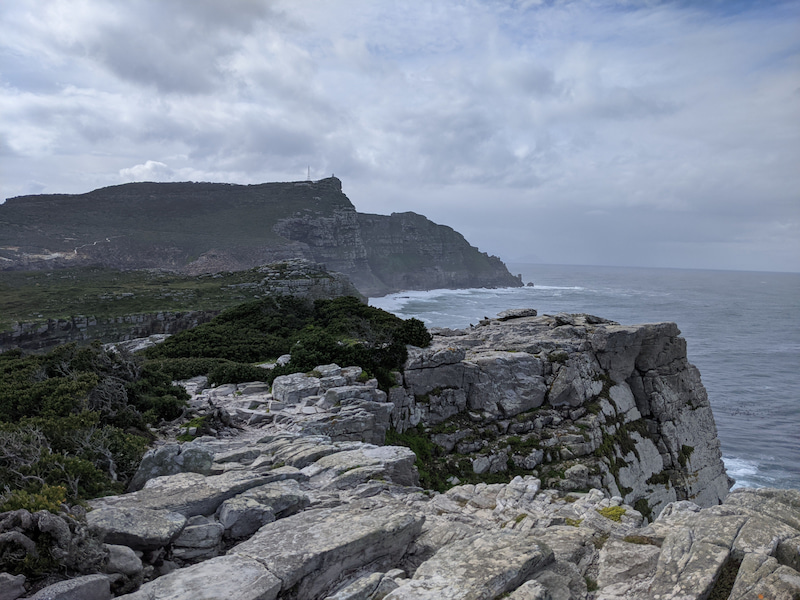

There are a number of amazing trails in the Cape Point National Park. There are views for days, cliffs, beaches and even tidal pools to swim in. It costs R85 per person (SA residents) and I recommend you get in early and spend the day because there is so much to see and do.

We did the Cape of Good Hope Trail which is a short steep hike which starts from the Cape of Good Hope viewpoint or the LLighthouse parking. There is an isolated beach called Diaz Beach in the middle of the walk. I recommend you go down the very steep stairs to the beach as its very beautiful. [https://www.alltrails.com/trail/south-africa/western-cape/cape-of-good-hope-trail] (https://www.alltrails.com/trail/south-africa/western-cape/cape-of-good-hope-trail)

We also did a bit of the Sirkelvlei Trail or shipwreck trail to see a shipwreck. We only walked to the first shipwreck called the SS Thomas T. Tucker, that is almost gone from my point of view. There is only a few more pieces of the metal ship left on the rocks. I enjoyed the walk and apparently it carries on to another shipwreck and past a lake. [https://www.alltrails.com/trail/south-africa/western-cape/sirkelvlei-trail] (https://www.alltrails.com/trail/south-africa/western-cape/sirkelvlei-trail) 

Then you also have to go up to the Lighthouse, it's a bunch of steps or a ride on the funicular. Once you at the top there is a short walk called the Lighthouse Keeper's Trail which takes you out to the furthermost point of Cape Point. There are beautiful views of the sea and you feel like you at the edge of the world. [https://www.alltrails.com/trail/south-africa/western-cape/cape-point-lighthouse-keepers-trail](https://www.alltrails.com/trail/south-africa/western-cape/cape-point-lighthouse-keepers-trail) 

There were a couple other walks we would like to try in the future.

No dogs allowed.